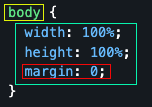

# CSS

### (Cascading Style Sheet)

Las reglas de estilo definen la presentación / diseño de los diferentes elementos de HTML en una página (u otros medios). Estas se organizan en reglas, que estan compuestas por selectores y bloques de propiedades.


## Syntax

+ Amarillo: Selector
+ Verde: Cuerpo de la regla
+ Rojo: Propiedad
+ Conjunto (todo): La regla

## Reglas
### Caracteristicas de las reglas
+ No son anidables (nesting).
+ Pueden tener n cantidad de propiedades.
+ Pueden tener n cantidad de selectores.
+ Se dan despues de un selector entre un `"{"` y un `"}"`.

## Selectores
### Caracteristicas de los selectores
+ Existe un selector especial que hace de comodín: `"*"`.
+ 

## Propiedades


```css
* {
  box-sizing: border-box;
}

h2 {
  margin: 0;
}

html,
body {
  width: 100%;
  height: 100%;
  margin: 0;
}

body > div {
  padding: 10px;
  color: black !important;
}

.flowItem {
  display: flex;
  flex-flow: row nowrap;
}

.flowItem:first-child {
  border-left: 1px solid #ffcc00;
}

.flowItem:nth-child(3) {
  border-right: 1px dashed #f13;
}
```